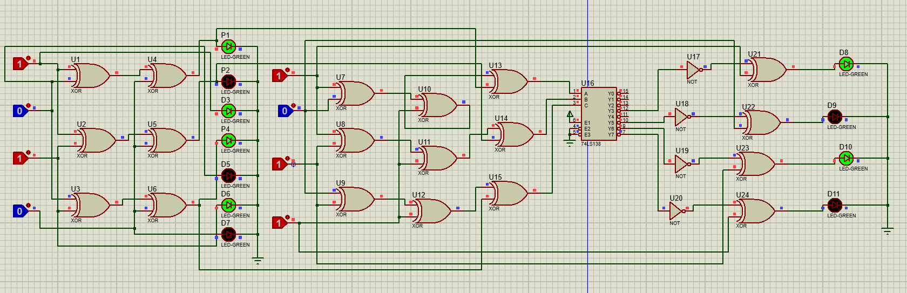

# Hamming Code Error Detection and Correction

## Project Overview

This project demonstrates the implementation of **Hamming Code for error detection and correction** in digital communication systems. The project was developed using both **hardware implementation** and **Proteus simulation** to understand how Hamming Code can detect and correct single-bit errors in transmitted data.

## Objectives

* To understand the working principle of Hamming Code.
* To implement error detection and correction.
* To design and test the circuit using Proteus simulation.
* To implement the concept using electronic hardware.
* To analyze the received data and identify the position of a single-bit error.

## How Hamming Code Works

Hamming Code adds **parity bits** to the original data bits before transmission. These parity bits are used at the receiver to identify whether an error has occurred and determine the position of a single-bit error.

The receiver calculates the parity conditions and generates a **syndrome value**. If the syndrome is non-zero, it indicates the position of the erroneous bit, which can then be corrected.

## Hardware Implementation

The Hamming Code circuit was implemented using electronic hardware components to demonstrate the practical operation of error detection and correction.

The hardware setup was tested by introducing a single-bit error and observing the correction process.

## Proteus Simulation

The complete circuit was designed and tested in **Proteus Design Suite** before/along with the hardware implementation.

The simulation was used to verify the logic of the Hamming Code circuit and observe the error detection and correction process.

## Components Used

* Digital Logic Gates
* Resistors
* LEDs
* Breadboard
* Connecting Wires
* Power Supply
* Other required electronic components

## Software Used

* Proteus Design Suite

## Project Demonstration

The hardware implementation and working of the Hamming Code Error Detection and Correction project are demonstrated in the video below.

🎥 [Watch Hamming Code Hardware Demonstration](https://youtube.com/shorts/Mx3zW7OXRyI?feature=share)

## Circuit Diagram

## Results

The project successfully demonstrates the detection and correction of a **single-bit error** using Hamming Code.

The hardware implementation and Proteus simulation were used to verify the working of the error detection and correction process.

## Skills Demonstrated

* Digital Electronics
* Error Detection and Correction
* Hamming Code
* Digital Logic Design
* Proteus Simulation
* Hardware Circuit Implementation
* Problem Solving

## Author

**Anshu Chauhan**

B.Tech – Electronics and Communication Engineering
Lovely Professional University

---

*This project was developed as part of my learning in Digital Electronics and Embedded/Hardware Systems.*
